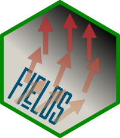

```{r, include = FALSE}
knitr::opts_chunk$set(
  collapse = TRUE,
  comment = "#>",
  fig.path = "man/figures/README-",
  out.width = "70%",
  fig.ext = "svg",
  dev = "ggsave"
)
```

# ggfields

## Overview

<!-- badges: start -->
[](https://github.com/pepijn-devries/ggfields/actions/workflows/R-CMD-check.yaml)

[](https://CRAN.R-project.org/package=ggfields)
[](https://cran.r-project.org/web/checks/check_results_ggfields.html)
[](https://pepijn-devries.r-universe.dev/ggfields)
[](https://codecov.io/gh/pepijn-devries/ggfields)
<!-- badges: end -->



Add vector field layers to your `ggplot2::ggplot()`. Although it has similarities
with `ggplot2::geom_spoke()`, `ggfields` offers some distinct features:

 * The `radius` aesthetic is mapped to a scale and therefore can be added
   to the guides (see `vignette("radius_aes")`).
 * Not only `data.frame`s are supported, but also geometric data
   (`sf::st_sf()` and `stars::st_as_stars()`).
 * Corrects angles for displayed aspect ratio or coordinate system
   (see `vignette("angle_correction")`).

## Installation

> Get CRAN version
```{r eval=FALSE}
install.packages("ggfields")
```

> Get development version from r-universe
```{r eval=FALSE}
install.packages("ggfields", repos = c("https://pepijn-devries.r-universe.dev", "https://cloud.r-project.org"))
```

## Adding vector fields to a map

The example below shows how seawater current data can be added to a map:

```{r init, results = 'hide', message = FALSE}
library(ggplot2)
library(ggfields)
library(ggspatial) ## For annotating with Open Street Map
```

```{r theme, echo = FALSE}
theme_set(theme_light())
set.seed(0)
```

```{r map, results = 'hide', message = FALSE, fig.width = 5, fig.height = 7, out.width = "50%"}
data(seawatervelocity)

ggplot() +
  ggspatial::annotation_map_tile(
    alpha      = 0.25,
    cachedir   = tempdir()) +
  geom_fields(
    data       = seawatervelocity,
    aes(radius = as.numeric(v),
        angle  = as.numeric(angle),
        colour = as.numeric(v)),
    max_radius = grid::unit(0.7, "cm")) +
  labs(colour  = "v[m/s]",
       radius  = "v[m/s]") +
  scale_radius_binned() +
  scale_colour_viridis_b(guide = guide_bins())

```

## Simple data.frames

Vector arrows can also be added to simple plots with `x` and `y` data:

```{r dataframe, results = 'hide', message = FALSE}
## First generate some arbitrary data to plot:
n  <- 10
df <- data.frame(x = seq(0, 100, length.out = n), y = rnorm(n),
                 ang = seq(0, 2*pi, length.out = n))
df$len <- 2 + df$y + rnorm(n)/4

ggplot(df, aes(x = x, y = y)) +
  geom_line() +
  geom_fields(aes(angle = ang, radius = len), .angle_correction = NULL)
```